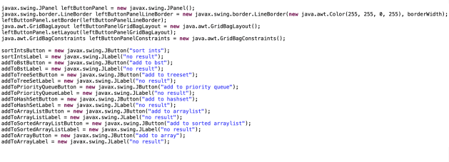
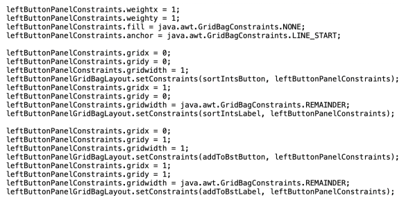
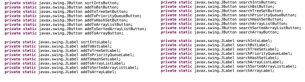
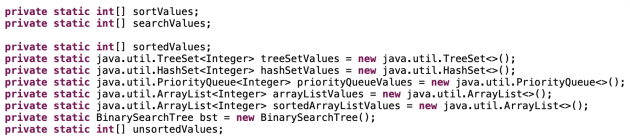
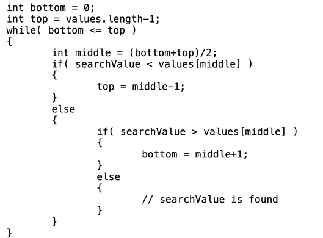

--------------------------------------------------
Program Assignment 08 - Due 12/9, by 11:59 pm
--------------------------------------------------

This is the final programming assignment for the semester. It will involve creating both a front end and back end.

Similar to previous assignments, there will also be a lab which will act as a starting point towards completing this assignment.

The final project is due at midnight on the last day of classes, 12/9/2022.
- But, I will accept submissions, for full credit, until midnight, on 12/16/2022.

Start by creating a file, `your_last_name_in_lower_case_p8.java`. It should reside within the `src` directory.

---------------------------------
Lab 12 - Due 11/29, by 11:59 pm
---------------------------------

Before you move on with the reset of Program Assignment 8, you will need to finish lab12. [For lab12, please do all the details specified here, then push up your changes to github.](/lab12/README.md) The commit hash on brightspace should correspond to what you finish by the end of lab12:

```
git add -A
git commit -m "finished lab 12, rest of program assignment 8 will come later."
git push
git rev-parse HEAD
```

To be clear here, lab12 will be completely captured and graded here, in the program assignment 08 repository. There is no separate lab12 repository. Your grade for program assignment 08 will also be based upon this repository, just for another commit hash that you will submit later on, when you finish it in its entirety.

If you finish lab12 early in lab, you may continue on to implement the rest of programming assignment 08. See below.

# STOP! Do not continue below until you have finished lab 12 above

## Description

- For program assignment 8, we will be reading two files of integer values.
	- The first file is the "sort" file
	- The second file is the "search" file
- When the files are read, the values are added to two `int` arrays.
	- In my code, I read the values into an `ArrayList<Integer>`, and once the entire file was read, my code copies the values into the appropriate `int[]`.

## Revisiting Selection Sort

- For programming assignment 1, we implemented selection sort to sort a `String[]`. 
- We will be re-using that method, except we will be updating it to sort an `int[]`.
- This update should be easy.
	- Replace `String[]` with `int[]`
	- Assuming the `String[]` is named `values`:
		- Replace `if(values[j].compareTo(values[min]) < 0)` with `if(values[j] < values[min])`
- That should be pretty much it.

## Part one

The first part of the remainder of the program is to ***evaluate various performances*** of sorting an array `int[] values` and also copying values into different data structures.

- Sort an `int[]` using the selection sort that we implemented in program one. `O(n^2)`.
- Add the values as keys into a binary search tree `O(n log n)`
- Add the values to a TreeSet `O(n log n)`
- Add the values to a PriorityQueue `O(n log n)`
- Add the values to a HashSet `O(n)`
- Add the values to an ArrayList `(unsorted, O(n))`
- Add the values to an ArrayList and use the `java.util.Collections.sort` to sort the values. `O(n log n)`
- Add the values to an `int[]` `(unsorted, O(n))`

- **Note:** Other than the `HashSet`, the `ArrayList` (unsorted), and `int[]` (unsorted), each of the above data structures will have sorted the data either while adding it or after adding it
- **Our Goal:** Keep track of the time spent performing each of the above.

## Part two

The second part of the remainder of the program is to ***evaluate various performances*** of searching for elements within difference data structures.

- Search for a value in a `int[]` smartly.
	- `O(log n) for each search`
	- Implement a binary search
- Search for a value in a Binary Search Tree 
	- `O(log n) for each search`
	- This is fast and easy, use the `getNode()` method
- Search for a value in a TreeSet 
	- `O(log n) for each search`
	- This is fast and easy, use the `contains()` method
- Search for a value in a PriorityQueue 
	- `O(n) for each search.`
	- This is slow, even though the PriorityQueue uses a heap to store the values, and the polling is quick, using the `contains()` method is very slow (and documented as such).
	- **Note:** Keep in mind, heaps are primarily used to quickly grab the next value from the priority queue, and was not optimized for searches.
- Search for a value in a HashSet
	- `O(log n)` garaunteed for each search, this might be `O(1)`
		- This is fast and easy, use the `contains()` method.
- Search for a value in an `ArrayList` in a naive way
	- `O(n)` for each search
	- This is slow, use the `contains()` method.
- Search for a value in an `ArrayList` in a smarter way.
	- `O(log n)` for each search.
	- This is fast, use the `java.util.Collections.binarySearch`
- Search for a value in a `int[]` naively.
	- `O(n)` for each search.
	- This is slow, use a for loop to search.

## Program Description

As you already saw from lab12, the program has a GUI component (our front end) and a non-GUI component (our backend).

Focusing on the non-GUI component, we will:
- Read the two files
- Create various data structures
- Populate the data structures
- Search for values in the data structures
- Track the time to do the various tasks.
- Report the number of search elements found in the various data structures

## Front end slides 

[Please refer to these slides showcasing what is happening in the front end for our GUI.](front_end_slides.pdf)

## Quick note about Threading Back end and Front End Separately 

Generally, when you create a GUI, if any of the work behind the GUI is going to take time, the GUI and the back end computations are done in separate threads.

- This stops the GUI from freezing while waiting for the back end computations to complete.
- Generally speaking, anything that takes more than 10 - 20 ms is long enough that the delay might be noticable to a typical user.

- **Note:** We are NOT going to deal with this issue for our program.
- When you select the `sort ints`, `search arraylist`, `search priority queue`, and `search array` for the larger test files, you will definitely notice that the GUI will temporarily freeze while waiting for the computations to complete.
- Sorting the 100,000 value file with selection sort takes around 3.5 seconds on my laptop, and the `250,000` value file takes around 23 seconds.

## Back end details

### The GridBagLayout manager

- This is fairly complex. 
- Here is what my code looks like for the `leftButtonPanel`:
	- Instantiate the panel
	- Instantiate the `GridBagLayout`
	- Set the layout of the panel
	- Instantiate the left buttons and panels.



### Adding buttons and labels to the left panel

Here is whay my code looks like for the first couple of buttons and labels being added to the leftButtonPanel:



### Requirements regarding State Management for your front end

- For my `JButtons` and `JLabels`, I declare them as `static` fields in the class, and when initially instantiated, the `JButtons` are disabled.
- When the input files are read, I enable the appropriate `JButtons`.
	- Refer back to the front end slides for more details, but it should be intuitive.
	- The search buttons are enabled when both the search file is read and the correspnding "sort/add" button is selected.
		- Your code needs to handle both cases where the search file is read ***BEFORE*** and ***AFTER*** the corresponding "sort/add" button is selected.
- Each of the `JButtons` need to have an `ActionListener` defined for it. 
	- See `example2a.java`
- All of my code is in a single file. This is not required, but it does work.
	- Except for the binary search tree code, which I re-used from program 5.

### Here is a list of all the methods implemented in my code.

1. `private static void selectionSort()`
2. `private static int searchInts()`
3. `private static void addToBinarySearchTree()`
4. `private static int searchBinarySearchTree()`
5. `private static void addToTreeSet()`
6. `private static int searchTreeSet()`
7. `private static void addToHashSet()`
8. `private static int searchHashSet()`
9. `private static void addToPriorityQueue()`
10. `private static int searchPriorityQueue()`
11. `private static void addToArrayList()`
12. `private static int searchArrayList()`
13. `private static void addToSortedArrayList()`
14. `private static int searchSortedArrayList()`
15. `private static void addToArray()`
16. `private static int searchArray()`
17. `private static void readData(String filename, boolean readSortValues)`

### Here are the two inner classes that I use (see example2a.java)

1. `static class MenuItemActionListener implements java.awt.event.ActionListener`
2. `static class ButtonActionListener implements java.awt.event.ActionListener`

### Here is a cross refernece between my buttons and the functions

| Button | Function |
| ------ | -------- |
| sort ints       			| `private static void selectionSort()` |
| add to bst       			| `private static void addToBinarySearchTree()` |
| add to treeset       		| `private static void addToTreeSet()` |
| add to priority queue     | `private static void addToPriorityQueue()`  |
| add to hashset       		| `private static void addToHashSet()` |
| add to arraylist       	| `private static void addToArrayList()` |
| add to sorted arraylist   | `private static void addToSortedArrayList()` |
| add to array       		| `private static void addToArray()` |
| ------------------------- | ---------------------------------- |
| search sorted ints       	| `private static int searchInts()` |
| search bst       			| `private static int searchBinarySearchTree()` |
| search treeset       		| `private static int searchTreeSet()` |
| search priority queue     | `private static int searchPriorityQueue()` |
| search hashset       		| `private static int searchHashSet()` |
| search arraylist       	| `private static int searchArrayList()` |
| search sorted arraylist   | `private static int searchSortedArrayList()` |
| search array       		| `private static int searchArray()` |

- And the two menu items both use `private static void readData(String filename, boolean readSortValues)`

### Here are my button and label declarations

- Since they are fields of the class, they can be accessed directly by the methods in the class. 
	- This will be useful when needing to enable buttons as the state changes.
- They can't be access directly by the inner classes of the main class, but they can be accessed if we pass them as a paramter of the inner class constructor.
	- See example2a.java
- You don't need to use my variable names, they are just to show you an example of what I did.



### Here are my data storage declarations

| Field | Description |
| ----- | ----------- |
| `int[] sortValues`   							| contains the list of values read from the “sort file”   |
| `int[] searchValues` 							| contains the list of values read from the “search file” |
| `int[] sortedValues` 							| is the array that is sorted in selectionSort() | 
| `TreeSet<Integer> treeSetValues` 				| is the tree set used for adding to and searching |
| `HashSet<Integer> hashSetValues>` 			| is the hash set used for adding to and searching |
| `PriorityQueue<Integer> priorityQueueValues` 	| is the priority queue used for adding to and searching |
| `ArrayList<Integer> arrayListValues` 			| is the unsorted ArrayList used for adding to and searching |
| `ArrayList<Integer> sortedArrayListValues` 	| is the sorted ArrayList used for adding to and searching |
| `int[] unsortValues` 							| is the unsorted `int[]` used for adding to and searching |
| `BinarySearchTree bst` 						| is the binary search tree used for adding to and searching |



### Getting the time estimates

To get the time estimates, simply capture the time just before and just adter calling the various methods:


``` java
long t0 = System.currentTimeMillis();
long t1 = System.currentTimeMillis();
```

The set the text to `(t1 - t0) + "ms"` for the appropriate label.

### How to implement the ActionListeners

- For the two `ActionListeners`, in their `actionPerformed()` methods, I have a collection of `if` statements to determine which button or menu item was selected, and then call the appropriate method to perform the required action.
	- See example2a.java

- The vast majority of my code is related to the GUI.
- The other code, reading the input files, and adding/sorting/searching for values is quite small in comparison.
	- For the TreeSet, HashSet, unsorted ArrayList, and PriorityQueue, we are just using the `add()` and `contains()` methods.
	- For the binary search tree, we are just doing the `insertNode()` and `getNode()` methods.

### Requirements for the search labels

- The search methods return the number of values found
- The label associated with the “search” buttons are updated with the number of search values found and the time spent searching for them.
	- **Note:** The labels should have `X / Yms` after performing the search
	- Where `X` is the number of values found in the search and `Y` is the number of milliseconds to perform the search

### Implementing the Binary search 

The following code assumes that you are dealing with an already sorted array:



## Nice work.

If you made it to the end, congratulations! Developing front end and back end is no small feat, especially for an intro course. 

## Extra credit

If you wish, you can try to do a ***merge sort*** for ***10 extra points of extra credit***.

- [I have also posted some expected results, which you can find here.](expected_results_and_extra_credit.pdf)

## Submission

Submit your finished program to github and post the latest commit hash on BrightSpace.

```
git add -A
git commit -m "finshed program assignmnent 08"
git push
git rev-parse HEAD
```
